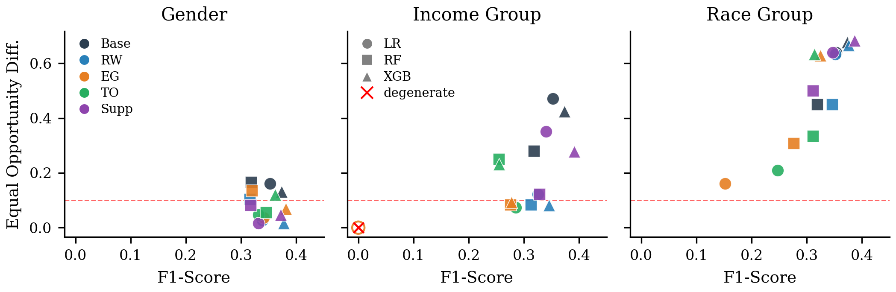
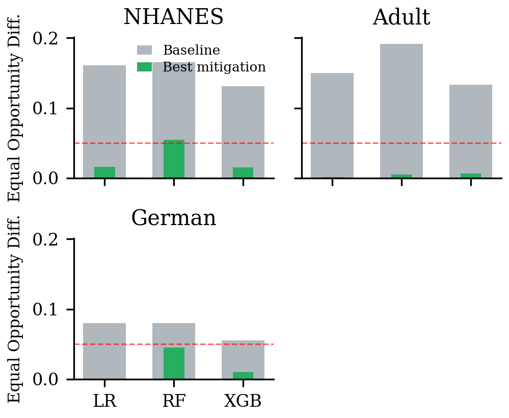

# Fairness Audit Pipeline for High-Risk ML Applications

A model-agnostic pipeline covering bias **detection, mitigation, and reassessment**, validated under one frozen protocol on six datasets spanning healthcare, education, finance, and income prediction (positive prevalence 0.12 to 0.70). MSc Practicum, Dublin City University, 2026.

> **Note:** AIF360 and Fairlearn supply metrics and algorithms. They do not supply a validated end-to-end workflow. This project adds the workflow, two diagnostic criteria that catch failure modes the standard metrics miss, and a shared plotting layer that turns a new dataset into 20+ comparable analysis figures once its adapter exists.

## Overview

The EU AI Act classifies medical prediction and student performance evaluation as high-risk applications and requires fairness assessment before deployment. Existing fairness work mostly evaluates a single prediction task, studies detection and mitigation in isolation, and rarely validates a reusable method across datasets.

The pipeline here keeps the evaluation and mitigation modules free of dataset-specific logic. A new dataset connects through one adapter and inherits the full experimental matrix: 3 classifiers × (Baseline + 4 treatments) × all sensitive attributes. The Baseline arm serves as detection, the mitigated arms as reassessment.

<!-- 图 1：pipeline 架构图（论文 Fig. 1 / PPT 第 5 页）

-->

Two diagnostic criteria run as pure post-processing over the evaluation output, adding zero extra experiments:

| Criterion | What it catches |
|---|---|
| **False-Fairness Criterion** | A collapsed model reading as perfectly fair. Flags `min TPR < 0.05` together with `ΔEOpp < 0.05` |
| **Model-Manufactured Disparity Metric** | Splits an observed selection-rate gap into the data-inherent share and the model-added share |

### Key Results

| Finding | Evidence |
|---|---|
| Standard metrics can certify a collapsed model as fair | NHANES / LR / income / ExponentiatedGradient: 1 positive prediction across 1,091 test instances, recall 0.000, yet ΔEOpp = 0.000 and ΔDP = 0.001. The single flagged case among 105 configurations |
| Models amplify disparity beyond the data | True base-rate gap 0.133 becomes an output selection-rate gap of 0.588, a model-added share of 0.456 |
| Dropping the sensitive column does not remove bias | Suppression retains 0.212 (NHANES income) and 0.218 (NHANES race) of model-added disparity through correlated proxy features |
| Mitigation conclusions flip with the base classifier | NHANES race under EG: LR 0.640 → 0.161 (−75%), XGBoost 0.677 → 0.628 (−7%). OULAD region (13 groups) under ThresholdOptimizer: RF worsens from 0.140 to 0.488 |
| Binary attributes behave consistently | Gender gaps fall to at or near 0.05 on every dataset at negligible F1 cost |

<!-- 图 2：NHANES fairness-performance trade-off（论文 Fig. 2）

*Hollow marker at zero F1 and zero gap: the degenerate configuration the False-Fairness Criterion flags.*
-->

## Methodology

### Dataset Characterisation

Datasets are organised by four measurable properties rather than by application domain: positive prevalence, sensitive-attribute cardinality, subgroup base-rate gap, and subgroup sample size.

| Dataset | Domain | n | Prevalence | Sensitive attributes (cardinality) |
|---|---|---|---|---|
| NHANES 2021–2023 | Healthcare | 5,455 | 0.13 | gender (2), income (3), race (5) |
| Adult Income | Income | 48,842 | 0.24 | sex (2), race (5) |
| German Credit | Credit | 1,000 | 0.70 | sex (2), age group (2) |
| OULAD | Education | 32,593 | 0.47 | gender (2), region (13), age band (2) |
| Bank Marketing | Finance | 45,211 | 0.12 | age, marital status, education (2 each) |
| Credit Card Clients | Finance | 30,000 | 0.22 | gender (2) |

NHANES and OULAD cover the two high-risk domains that motivate the work. The other four are standard fairness benchmarks, which keeps results comparable to published baselines.

### Treatments

One method per lifecycle stage plus one control, each applicable to an arbitrary base classifier:

- **Reweighing** (pre-processing, AIF360): sample weights from the joint distribution of sensitive attribute and label
- **ExponentiatedGradient** (in-processing, Fairlearn): reductions under an equalized odds constraint, slack 0.01, 50 iterations
- **ThresholdOptimizer** (post-processing, Fairlearn): per-subgroup decision thresholds, 20% internal validation split to avoid leakage
- **Suppression** (control): retrain after dropping the sensitive column, testing the assumption that blindness produces fairness

### Evaluation Protocol

Identical across datasets: stratified 80/20 split, 5-fold stratified CV on the training set, final fit on the full training set, all results on the held-out test set, seed 42. Classifiers are Logistic Regression, Random Forest, and XGBoost, covering a linear model, a bagging ensemble, and a boosting ensemble. Random Forest and XGBoost are tuned by randomised search over 50 candidates under 5-fold CV scored on ROC-AUC; class imbalance is handled uniformly through balanced class weights and `scale_pos_weight`.

Group-level output records selection rate, TPR, FPR, subgroup size, and true prevalence. Aggregate output reports Demographic Parity, Equal Opportunity, and Equalized Odds differences as max minus min across subgroups. Equal Opportunity leads the figures: it is built from TPR alone, so a change in the gap has a single interpretation, and in healthcare and education the costly error is missing someone who needs help.

<!-- 图 3：六数据集 gender 对比（论文 Fig. 5）

-->

### Shared Visualisation Layer

Reading fairness results is where cross-dataset work usually breaks down: each dataset gets its own ad-hoc plots, and comparison stops being possible. One plotting module serves every dataset here. A new dataset supplies a config object (attribute names, subgroup labels, result paths) and receives the full figure set without new plotting code:

| Group | Figures |
|---|---|
| Baseline | Performance summary, subgroup TPR/FPR dumbbells, per-attribute detail |
| Mitigation | Fairness and performance grids over the full method × classifier matrix, per-method gap comparison, disparity reduction |
| Trade-off | Equal Opportunity difference against F1 for every configuration |
| Diagnostics | False-fairness quadrant, amplification decomposition |
| Cross-domain | Heatmap, gender comparison, reduction matrix across datasets |

Both IEEE paper style and presentation style render from the same code path, and every figure regenerates from the archived result CSVs. Adding a dataset therefore costs one adapter and one config, not a plotting rewrite.

## Tech Stack

- **Language:** Python 3.11
- **Fairness:** Fairlearn 0.11 (MetricFrame, ExponentiatedGradient, ThresholdOptimizer), AIF360 0.6 (Reweighing)
- **ML:** scikit-learn, XGBoost
- **Data Processing:** pandas, NumPy, statsmodels
- **Visualisation:** matplotlib, seaborn

## Project Structure

```
src/
├── fairness_pipeline/              # Frozen dataset-agnostic core
│   ├── fairness_eval.py            # Group-level and aggregate metrics via Fairlearn MetricFrame
│   ├── mitigation.py               # Reweighing / EG / ThresholdOptimizer / Suppression
│   └── diagnostics.py              # False-Fairness Criterion + Model-Manufactured Disparity
├── nhanes/                         # Healthcare adapter (low-prevalence anchor)
│   ├── data_loader.py              # Ten NHANES XPT survey tables into one dict of frames
│   ├── preprocessing.py            # Per-table cleaning, feature engineering, merge, encoding,
│   │                               #   multicollinearity check
│   ├── models.py                   # Classifier construction and hyperparameter search
│   ├── nhanes_fairness.py          # Experiment driver: baseline + four treatments, result export
│   ├── visualization.py            # Shared plotting layer, reused by Adult and German
│   └── notebooks/EDA.ipynb
├── benchmark/                      # Adult Income and German Credit adapters
│   ├── adult_fairness.py           # Loading, EDA, models, full mitigation matrix
│   ├── german_fairness.py
│   ├── adult_visualization.py      # Dataset config feeding the shared plotting layer
│   └── german_visualization.py
├── partner-extensions/             # OULAD, Bank Marketing, Credit Card Clients (notebooks)
├── results/                        # Metric exports and figures per dataset
│   ├── nhanes/ , benchmark/adult/ , benchmark/german/
│   ├── oulad/ , More Datasets/
│   └── */figures/                  # 20+ figures per dataset from one shared layer
└── data/nhanes/                    # Raw NHANES 2021–2023 XPT files
```

## Running the Experiments

```bash
pip install -r requirements.txt
pip install -e .

python -m nhanes.nhanes_fairness      # NHANES: baseline + 4 treatments, 3 attributes
python -m benchmark.adult_fairness    # Adult Income
python -m benchmark.german_fairness   # German Credit
```

Each driver writes metric CSVs to `src/results/<dataset>/`, and the diagnostics module reads those files back to produce the two criterion tables. The visualisation modules regenerate every figure from the same CSVs.

## My Contributions

Two-person practicum. My work spanned every stage:

- **Pipeline core:** the dataset-agnostic evaluation and mitigation modules, the adapter interface that reduces a new dataset to one loader, and the unified result-storage layer that keeps output comparable across datasets
- **Diagnostic criteria:** design and implementation of both criteria, including the threshold sensitivity check (τ = 0.03, 0.05, 0.10 identify the same single flag) and the documented blind spot toward the symmetric all-positive collapse
- **NHANES adapter (solo):** loading, EDA, cleaning, and preprocessing of ten survey tables, each with its own skip patterns and special missing-value codes that turn "skipped" into "no" if handled carelessly. Constructed 9 of the 23 features in the final dataset, and built the PHQ-9 depression label at the clinical cutoff of 10
- **Modelling:** training and tuning of the three classifiers across NHANES, Adult Income, and German Credit, plus the connecting layer between models, mitigation, and evaluation
- **Experiments:** the full matrix on the three anchor datasets, 105 configurations in total
- **Visualisation layer:** the shared plotting module described above, covering baseline, mitigation, trade-off, diagnostic, and cross-domain figures. 20+ figures per dataset from one config object, in both IEEE and presentation styles, all regenerable from the archived CSVs
- **Literature and writing:** the shared fairness background, the healthcare section, and the survey of mitigation methods; paper sections split along the same lines as the experimental work

One finding came directly out of the modelling work: a default Random Forest reached 0.87 accuracy and 0.72 AUC under 5-fold CV while producing essentially zero recall. Tuning on ROC-AUC alone never exposes this, because AUC is threshold-independent. That result is the origin of the False-Fairness Criterion.

## Limitations

Stated in the paper rather than glossed over. Results come from one stratified split under seed 42, so point estimates carry split sensitivity, and no confidence intervals are reported. Domain and prevalence co-vary across the core datasets, so every characteristic-related statement stays descriptive rather than causal. The False-Fairness Criterion is built on a recall floor and is structurally blind to the all-positive collapse under high prevalence. Analysis treats one sensitive attribute at a time; crossing race with gender on NHANES leaves roughly three positive cases in the smallest cell, so intersectional analysis needs a larger sample.

The pipeline is an audit tool for models, not a decision system. Real deployment would require robustness checks, expert input on the fairness objective, and post-launch monitoring.

## Data Sources

| Dataset | Source |
|---|---|
| NHANES 2021–2023 | [CDC / NCHS](https://wwwn.cdc.gov/nchs/nhanes/) |
| Adult Income | [UCI ML Repository](https://doi.org/10.24432/C5XW20) |
| German Credit | [UCI ML Repository](https://doi.org/10.24432/C5NC77) |
| OULAD | [Open University Learning Analytics Dataset](https://analyse.kmi.open.ac.uk/open-dataset) |
| Bank Marketing | UCI ML Repository (Moro, Cortez & Rita, 2014) |
| Credit Card Clients | UCI ML Repository (Yeh & Lien, 2009) |

## Authors

- **Shubin Li** — pipeline core, diagnostic criteria, visualisation layer, NHANES / Adult / German experiments
- **Lamaan Kayum Shaikh** — extension datasets and supporting analysis

Supervisor: Dr. Tai Tan Mai. MSc in Computing (Data Analytics), Dublin City University, 2026.
